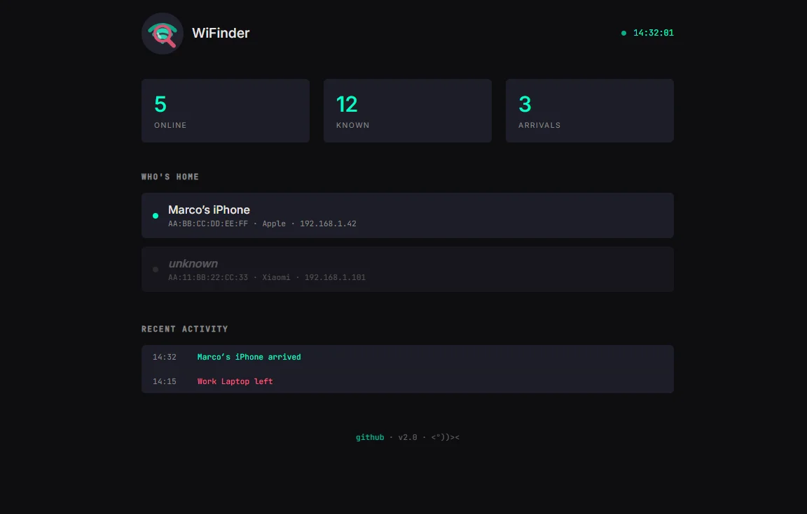

# WiFinder

[](https://www.python.org/downloads/)
[](https://www.gnu.org/licenses/gpl-3.0)
[](https://pypi.org/project/wifinder/)

> Know who's home. Panic when needed.

A simple network presence detector.
Written in 2013 to know when the roommate was about to walk in - rewritten because why not.



## Features

- **Network Scanning:** automatic network detection, MAC vendor lookup.
- **Device Management:** name devices, track first/last seen.
- **Notifications:** desktop notifications, sound alerts, Telegram bot.
- **Web UI (optional):** dark-mode dashboard, real-time updates, access from any device.

## Why

Sometimes you want to set up a whole home automation stack.
Sometimes you just want to know who's on your network.

---

## Installation

### Requirements
- Python 3.10+
- nmap (`apt install nmap` / `brew install nmap` / [Windows](https://nmap.org/download.html#windows))
- Root/sudo access (for network scanning)

From PyPI:
```bash
pip install wifinder
```

Or with Docker:
```bash
docker run -d --network host -v wifinder-data:/data ghcr.io/mpescimoro/wifinder
```

Or from source:
```bash
git clone https://github.com/mpescimoro/wi-finder.git
cd wi-finder
pip install -e .
```

---

## Usage

```bash
wifinder init                    # setup wizard
sudo wifinder watch              # monitor (linux/mac)
wifinder watch                   # monitor (windows, run as admin)
wifinder watch --panic           # panic mode
```

```bash
wifinder scan                    # single scan
wifinder list                    # list devices
wifinder list --all              # include offline
wifinder add AA:BB:CC "Marco"    # name a device
wifinder log                     # arrival/departure log
wifinder serve                   # web ui on :8080
```

System beep on arrivals by default. Enable desktop notifications in config.

---

## Panic Mode

The original 2013 experience. Big alerts when someone arrives.

```bash
wifinder watch --panic
```

```
┌────────────────────────────────────────┐
│     OHSHITOHSHITOHSHITOHSHIT!          │
└────────────────────────────────────────┘

>>> Apple, Inc. (AA:BB:CC:DD:EE:FF)
    192.168.1.42
```

Customize in `~/.config/wifinder/config.yaml`:

```yaml
panic:
  enabled: true
  message: "HIDE EVERYTHING!"
  custom_messages:
    "AA:BB:CC:DD:EE:FF": "MOM'S HOME!"
```

---

## Web UI

```bash
sudo wifinder serve
```

Opens on `http://localhost:8080`. Works from your phone too.

---

## Telegram

Get a bot token from [@BotFather](https://t.me/botfather), your chat id from [@userinfobot](https://t.me/userinfobot), then:

```yaml
notify:
  telegram_token: "YOUR_BOT_TOKEN"
  telegram_chat_id: "YOUR_CHAT_ID"
```

---

## Configuration

Full config at `~/.config/wifinder/config.yaml`:

```yaml
network: 192.168.1.0/24
interval: 30            # scan every 30 seconds
device_ttl: 180         # wait 3 min before marking device as gone
web_port: 8080
web_host: 0.0.0.0

notify:
  sound: true           # system beep
  desktop: false        # desktop notifications
  telegram_token: null    # optional
  telegram_chat_id: null
  quiet_hours_start: 23   # quiet hours
  quiet_hours_end: 7
```

---

## Database

```bash
wifinder db-path          # show config and db paths
wifinder db-reset         # reset database (delete all data)
```

---

## FAQ

**Why root/sudo?**  
nmap needs privileges to see MAC addresses. On Windows, run as Administrator.

**Phone doesn't always show up**  
Modern phones turn off WiFi in standby. The `device_ttl` setting (3 min default) handles brief disconnections so you don't get spammed with false departures.

**Can I detect devices not on my network?**  
No. That would require monitor mode, which is probably illegal in half of Europe anyway.

---

GPL-3.0 — <a href="https://github.com/mpescimoro">mpescimoro</a> - Detecting roommates since 2013 - `<°))><`
